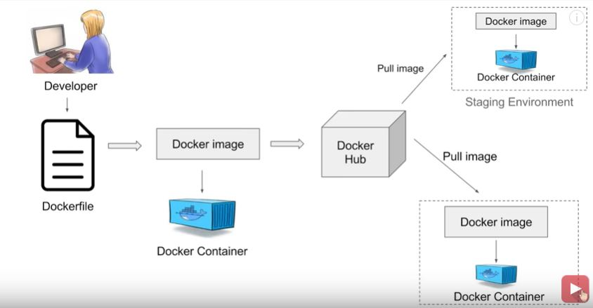
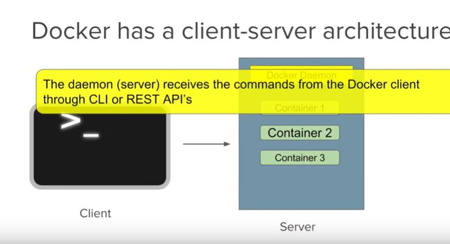
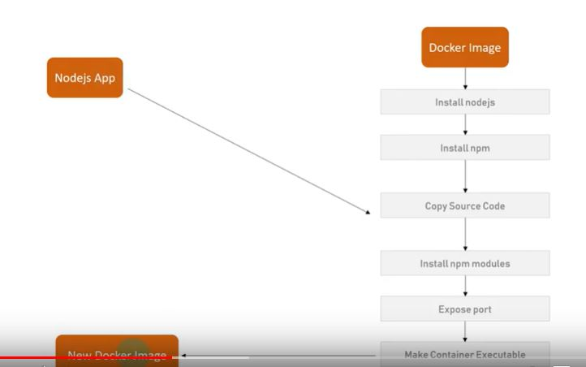

## Docker Commands:

1.  docker ps --> Show the list of all containers

## Docker Image

Images are templates to create docker container

## Container

Container is running instance of an image

## Registry

Images are stored in registry. Dockerhub is a registry

## WorkFlow

## Architechture

## Creating Docker Image
