### npm init to add package.json

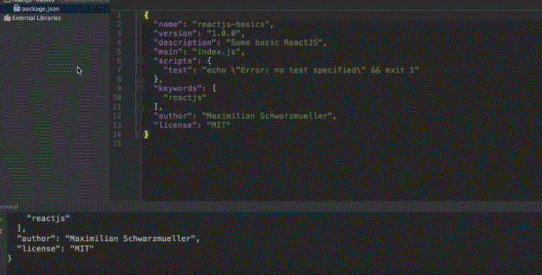

### Install Packages

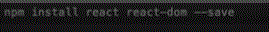

### Install Dev Dependancies

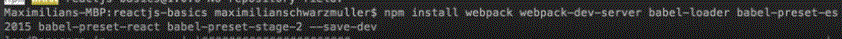

### Add index html

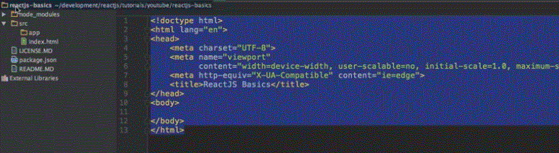

### Webpack Config

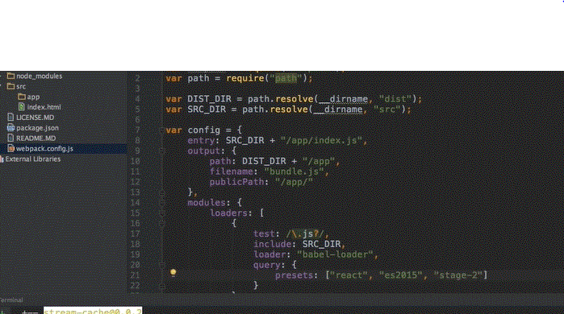

### Add bundle ref to index.html

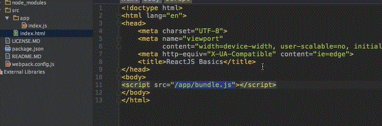

### Add build Command to json

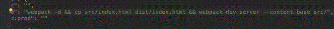
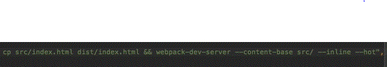
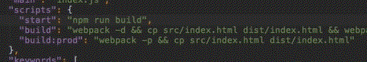

### Firtst Component
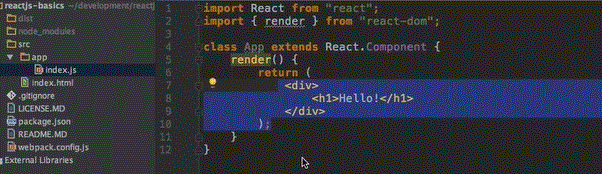

### Firtst Component
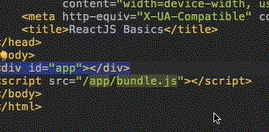

### Firtst Component
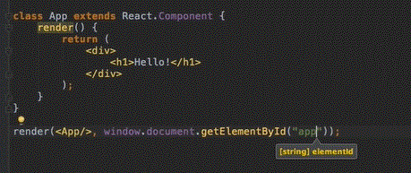

### Module Spelling correction
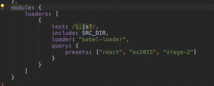
