## Creating Project

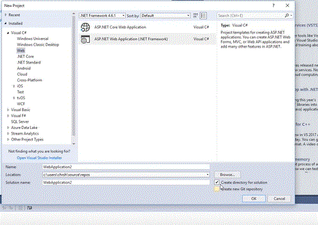

## Empty Project

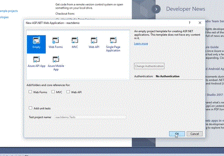

## mvc Controller

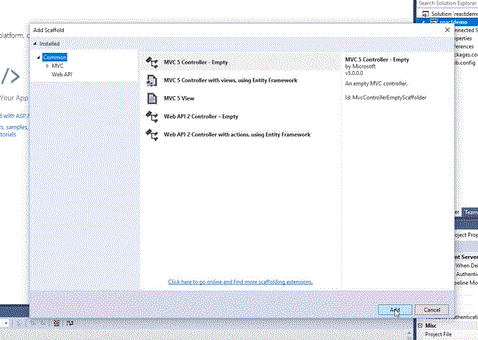

## Add view and select layout

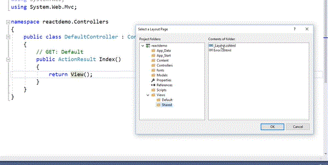

## Click Add View

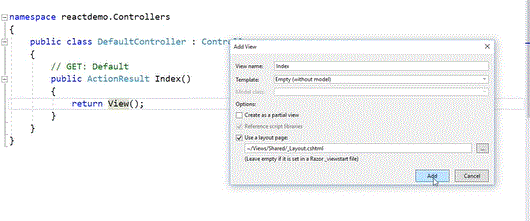

## Add Render Section On Top

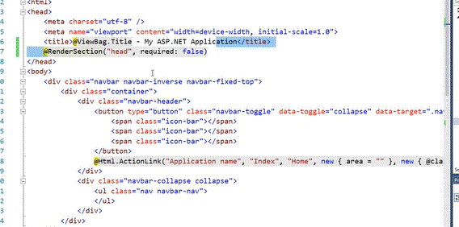

## Change App Name

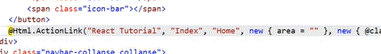

## Modify Route

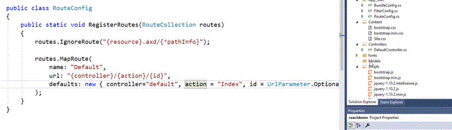

### Create a folder named "react" in script. Create package.json with following value

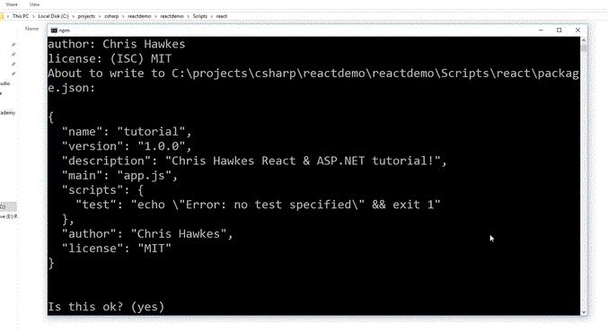

## Install React

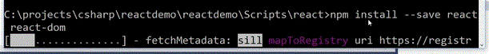

Include package.json but not node_modules

## Install Babel
For vs2019

npm install --save-dev @babel/core @babel/preset-env babel-loader @babel/preset-react webpack webpack-cli

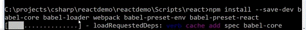

## Webpack Config
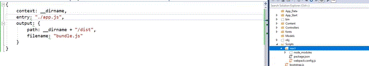

## appjs
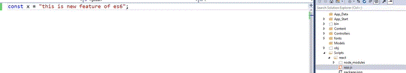

## modify WebpackConfig. run npm run webpack. Check dist folder

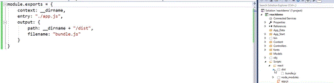

## Add webpack Rules

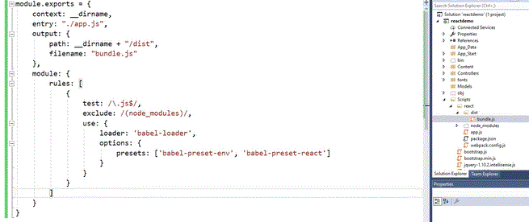

## Add AddWatch

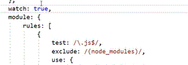

### For 2019 change webpack and package file

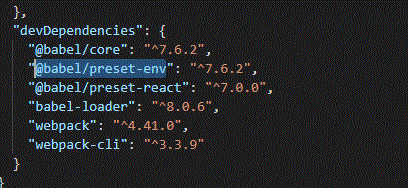
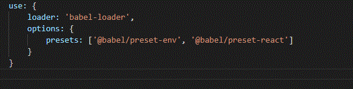

### React code

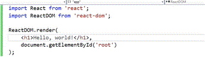

### Add root div and bundle script to controller view

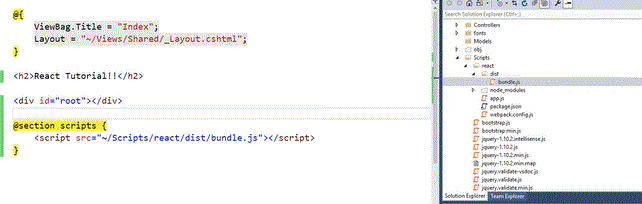

