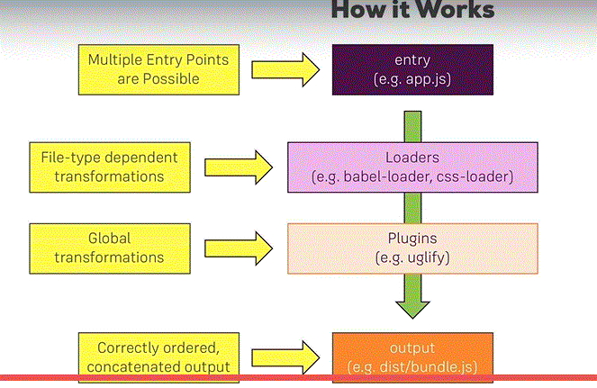

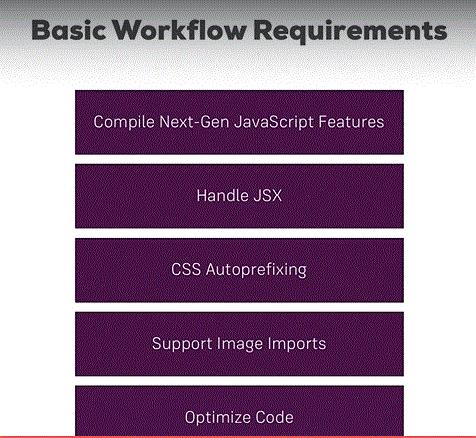

# Setup

## 1. npm init
## 2. Install webpack@3 and webpack-dev-server
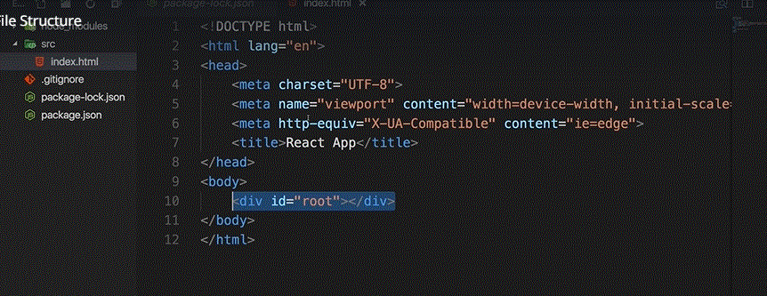

## 3. Add Necessary files and folders

## 3. Add all folders
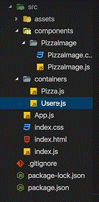

##  PizzaImage Comp
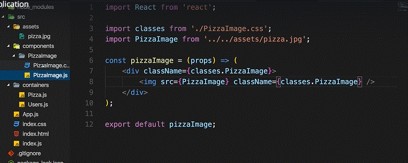

##  PizzaImage Css
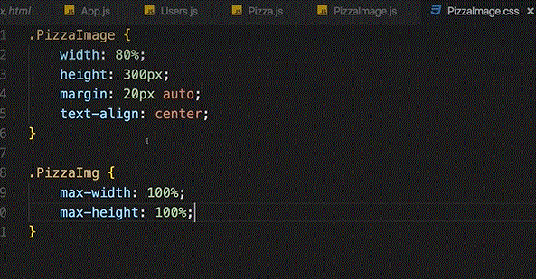

##  Pizz Comp
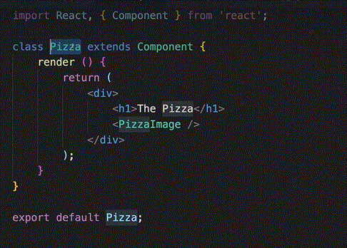

##  Users Comp
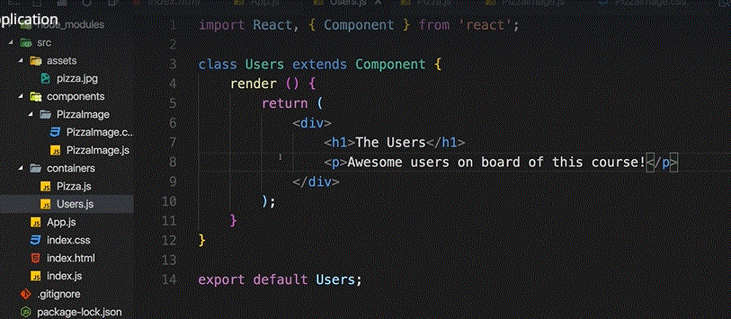

##  Asynch Comp
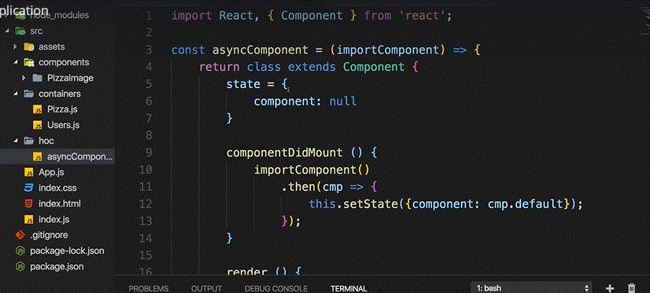

##  calling Asynch
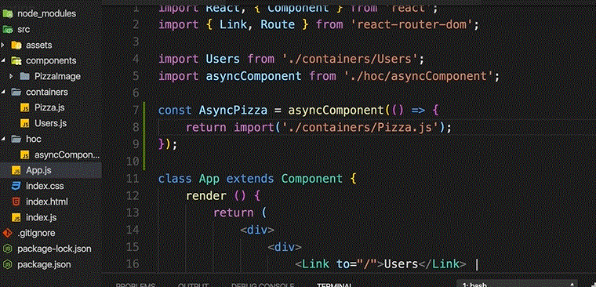

##  indexjs
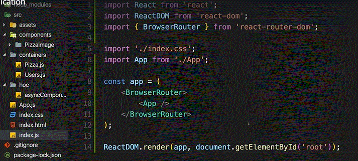
