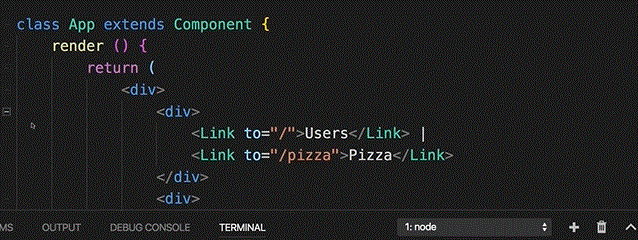
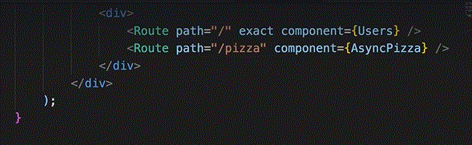
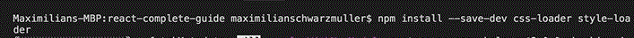
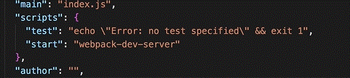
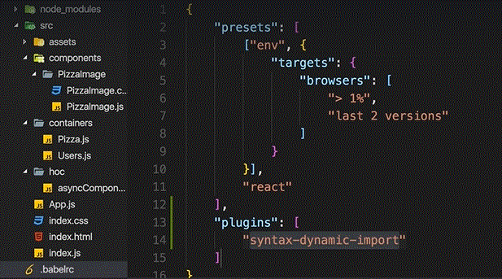
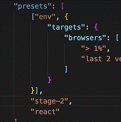
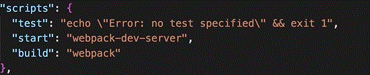
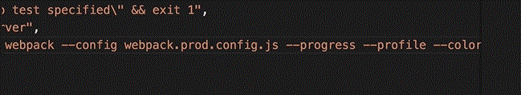
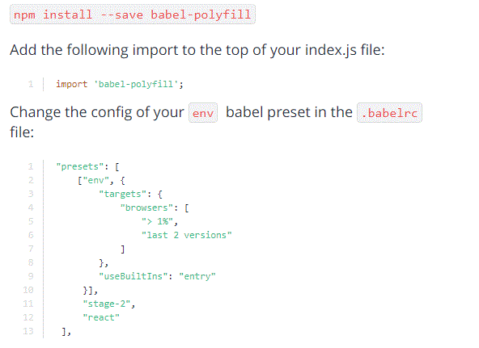

# Setup

## 1. npm init
## 2. Install webpack@3 and webpack-dev-server


## 3. Add Necessary files and folders


## 3. Add all folders


##  PizzaImage Comp


##  PizzaImage Css


##  Pizz Comp


##  Users Comp


##  Asynch Comp


##  calling Asynch


##  app Comp




##  indexjs


## Install dependancies react react-dom react-router-dom 
### Install dev dependancies babel-loader babel-core babel-preset-react babel-preset-env babel-plugin-syntax-dynamic-import

## Install Css Loader



##  Start Script


##  Install PostCssLoader


##  Install AutoPrefixer


##  Install UrlLoader


##  Install FileLoader


##  Install htmlPlugin


## Write webpack config


```javascript
//Since we have node installed we can get the node 'path' object
const path = require('path');
const autoprefixer = require('autoprefixer');//Used for saas compilation 
//Connect js code to the html file
const HtmlWebpackPlugin = require('html-webpack-plugin');

module.exports={
    //SourceMap maps between Original Source code and Transformed code to help debugging
    devtool: 'cheap-module-eval-sorce-map',
    entry: './src/index.js',
    output: {
        path: path.resolve(__dirname, 'dist'),
        filename: 'bundle.js',
        chunkFilaname: '[id].js',//Naming convention for lazy loaded files
        publicPath: 
    },
    resolve: {
        // If no extension is defined in 'import' webpack will look for these extensions 
        extensions: ['.js', '.jsx']
    },
    module: {
        rules: [
            {
                // The rule will be applicable to files end with .js
                test: /\.js$/,
                loader: 'babel-loader',
                exclude: /node_modules/
            },
            {
                test: /\.css$/,
                exclude: /node_modules/,
                use: [
                    { loader: 'style-loader' },
                    {
                        loader: 'css-loader',
                        options:{
                            importLoaders: 1,
                            modules: true,
                            //The css imported as modules will be compiled with this naming convention
                            localIdentName: '[name]__[local]__[hash:base64:5]'
                        }
                    },
                    {
                        loader: 'postcss-loader',
                        options:{
                            ident: 'postcss',
                            plugins: ()=> [
                                autoprefixer({
                                    browsers: [
                                        "> 1%",
                                        "last 2 versions"
                                    ]
                                })
                            ]
                        }
                    }
                ]
            },
            {
                test: /\.(png|jpe?g|gif)$/,
                //Images will go to this location
                loader: 'url-loader?limit=8000&name=images/[name].[ext]'
            },
            plugings: [
                new HtmlWebpackPlugin({
                    template: __dirname+ '/src/index.html',
                    filename: 'index.html',
                    inject: 'body'
                })
            ]
        ]
    }
}
```

## Add balelrc


## Add Add StageTwo Preset


## Build command


## Production Build command


## Old Browser Compatibility

