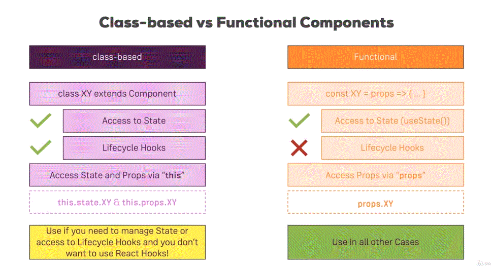

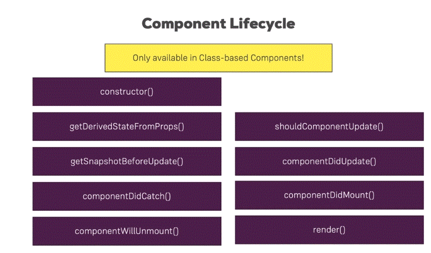

**Constructor**: Variable and state initailization can be done. But dont call api, state or props change, api call. Avoid all kind of side effect.

**render**: No api call, settimeout. In short no blocking code.

**componentDidMount**: Dont call setState sequencially. Can do on then block

## Sequence of Execution

#### Component create
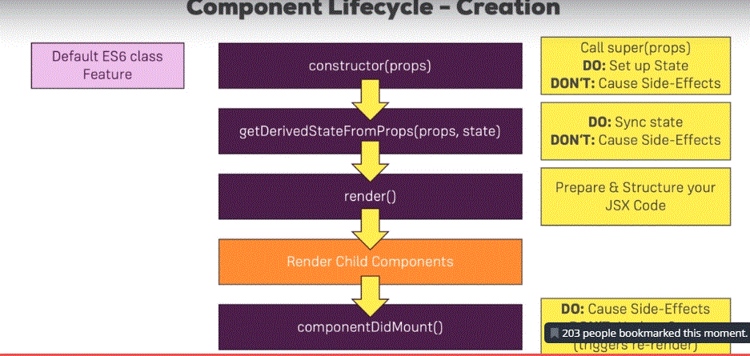

#### Component update
In component Update we should not call setstate synchronously, as that will cause a loop. We can call setstate in the then block of a async call

#### Convert person Function to Class
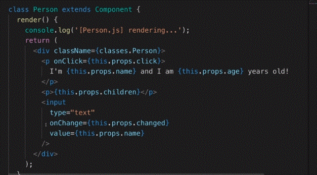

#### Convert persons Function to Class
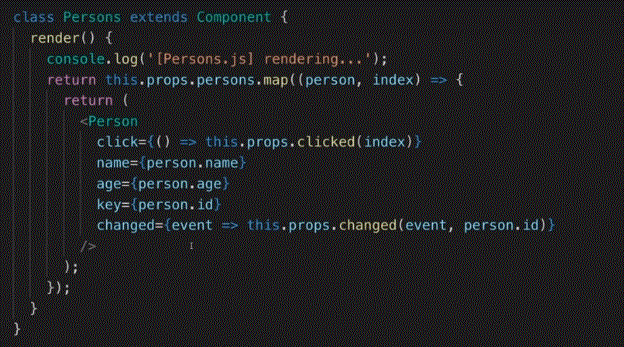

#### useEffect
Use effect is called on every render
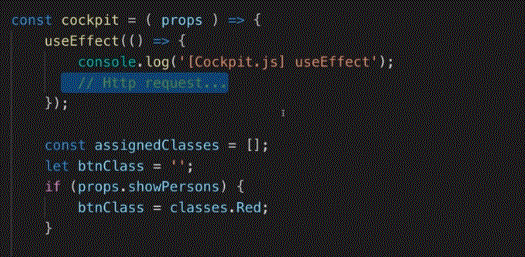

Call useEffect on persons prop change only

Use effect is called on every render
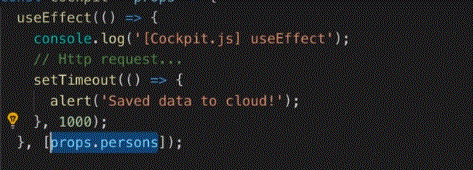

Use effect is called on every render
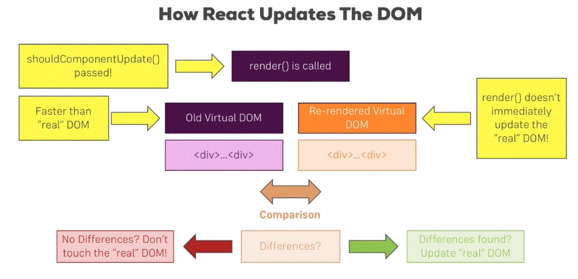

## Aux
Aux is used to wrap multiple jsx child

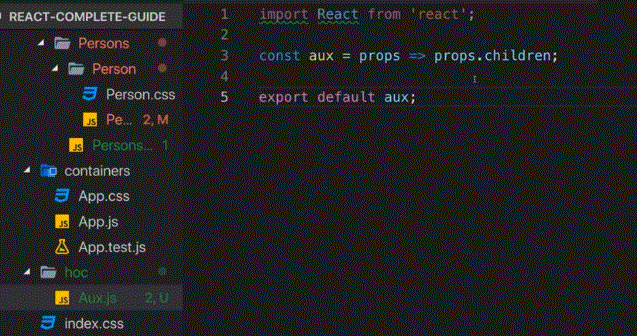

Wrapping with Aux

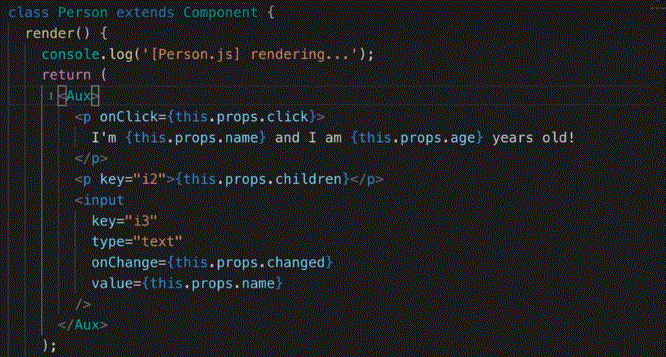

Higher Order Component

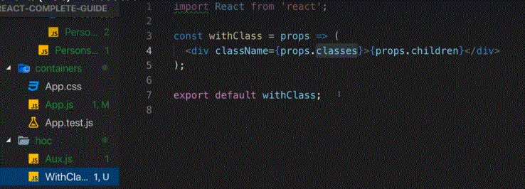

Wrap with Higher Order Component

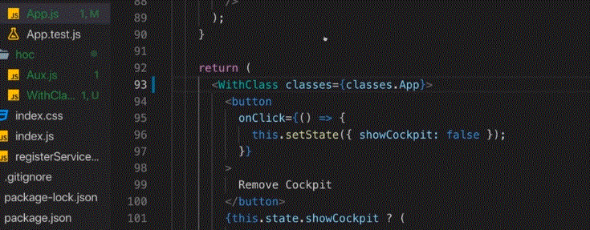

Higher Order Component Called through export

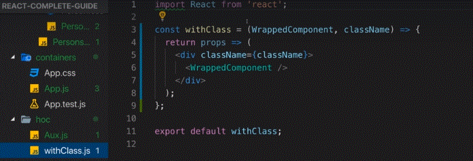

Using hoc

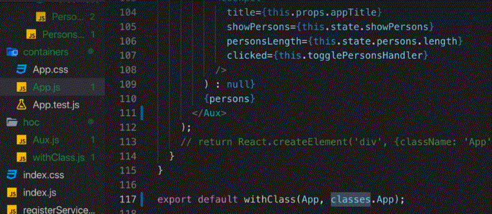

### Forwarding props to HOC

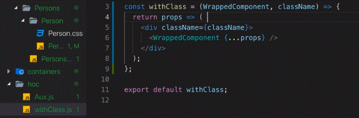

#### Call it from Person Comp

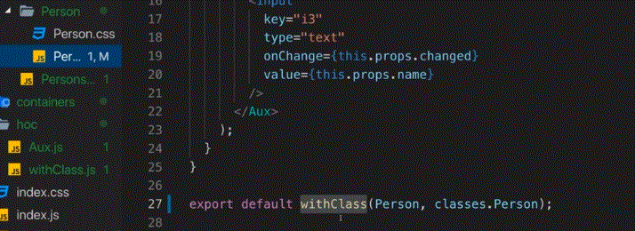

